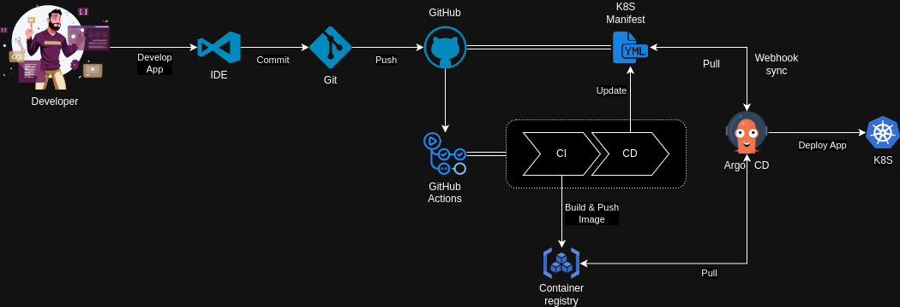

# KBot

DevOps application from scratch

**KBot** is a Telegram bot written in the Go programming language, utilizing the Cobra-CLI v1.8.0 framework for command handling and Telebot v3.1.4 for integration with the Telegram API.

## Installation

To get started with KBot, clone the repository:

```bash
git clone https://github.com/PTarasyuk/kbot.git
cd kbot
```

To install all necessary dependencies and compile the project, use:

```bash
go get
go build -ldflags "-X="github.com/PTarasyuk/kbot/cmd.appVersion=v1.0.2
```

To test the compiled project, do the following:

```bash
./kbot version
```

as a result, you should get the app's version `v1.0.2`.

## Configuration

Enter your Telegram bot token in silent mode:

```bash
read -s TELE_TOKEN
```

Export the value of the TELE TOKEN variable to the current shell environment.

```bash
export TELE_TOKEN
```

## Running

Run KBot using the following command:

```bash
./kbot start
```

## Link to Telegram bot

[@ptarasyuk_bot](https://t.me/ptarasyuk_bot)

## Usage

This project uses a Makefile for common tasks. Run the following commands:

- Format Code: `make format`
- Lint Code: `make lint`
- Run Tests: `make test`
- Get Dependencies: `make get`
- Build Application: `make build` (Override `REGISTRY`, `TARGETOS` and `TARGETARCH` with `make build REGISTRY=ptarasyuk TARGETOS=linux TARGETARCH=arm`)
- Create Docker Image: `make image` (Override `REGISTRY`, `TARGETOS` and `TARGETARCH` with `make image REGISTRY=ptarasyuk TARGETOS=linux TARGETARCH=arm`)
- Push Docker Image: `make push` (Override `REGISTRY`, `TARGETOS` and `TARGETARCH` with `make push REGISTRY=ptarasyuk TARGETOS=linux TARGETARCH=arm`)
- Clean: `make clean`

For more details and options, run `make help`.

## CI/CD

### Workflow



### ArgoCD

#### Install ArgoCD

First, let's create the `argocd' namespace in which the system will be installed by default:

```bash
kubectl create namespace argocd
```

To install ArgoCD, we will use the installation YAML file from the official repository:

```bash
kubectl apply -n argocd -f https://raw.githubusercontent.com/argoproj/argo-cd/stable/manifests/install.yaml
```

#### Install ArgoCD CLI

```bash
curl -sSL -o argocd-linux-amd64 https://github.com/argoproj/argo-cd/releases/latest/download/argocd-linux-amd64
sudo install -m 555 argocd-linux-amd64 /usr/local/bin/argocd
rm argocd-linux-amd64
```

#### Access Argo CD API Server

By default, the Argo CD API server is not exposed with an external IP.

Let's use port forward to access the ArgoCD API server using the local port 8080:

```bash
kubectl port-forward svc/argocd-server -n argocd 8080:443
```

#### Login

```bash
argocd admin initial-password -n argocd
```

This command will output the following:

```bash
vPhKYyUh3ItRHhvm

This password must be only used for first time login. We strongly recommend you update the password using `argocd account update-password`.
```

`vPhKYyUh3ItRHhvm` is our password (your password will be different).

```bash
argocd login 127.0.0.1:8080
```

You will need to accept the self-signed certificate by typing y, enter the username admin and the password `vPhKYyUh3ItRHhvm`.

#### Create the application using the Kubernetes manifest

```bash
argocd app create -f argocd/app.yaml --helm-set secret.key="YOUR_TELEGRAM_BOT_TOKEN"
```
